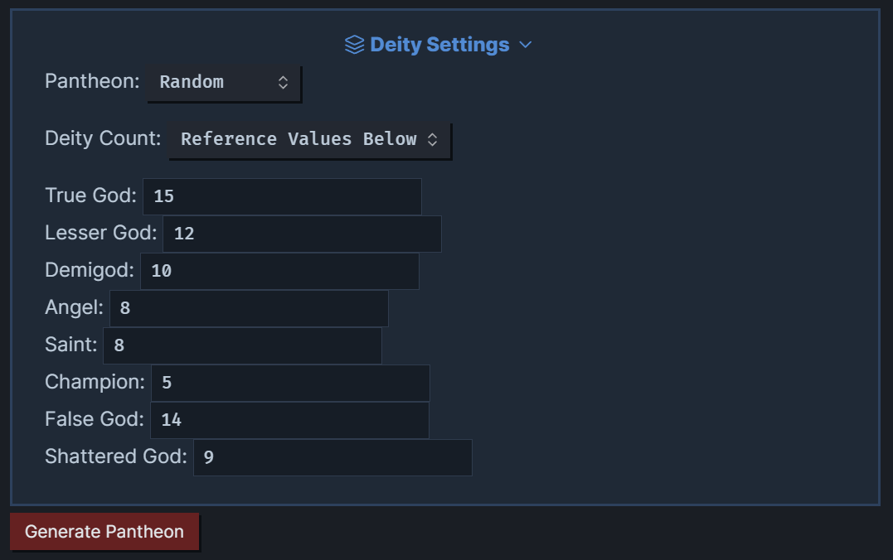
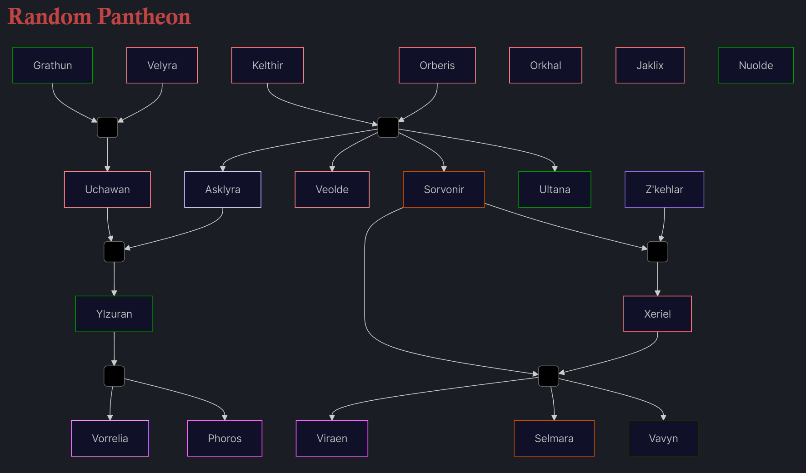
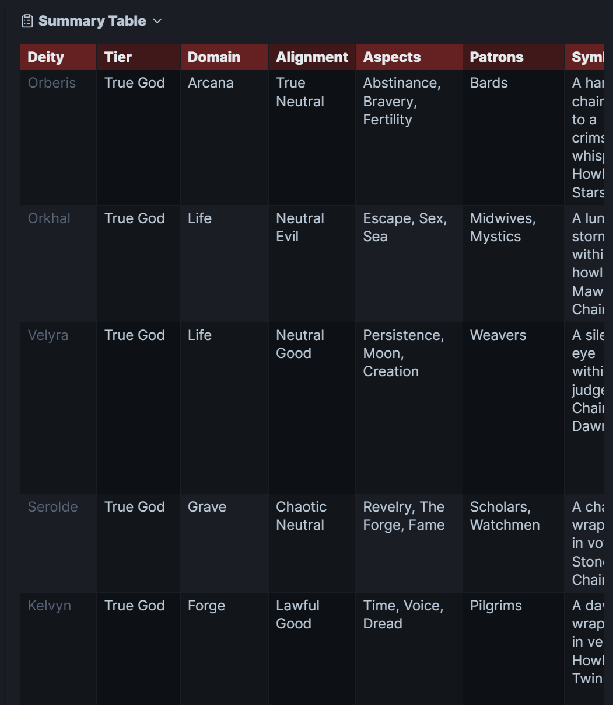
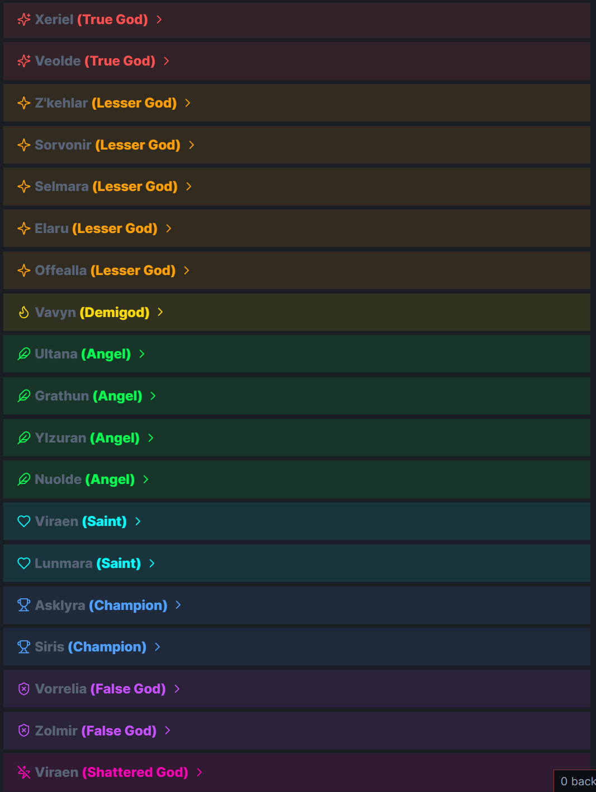
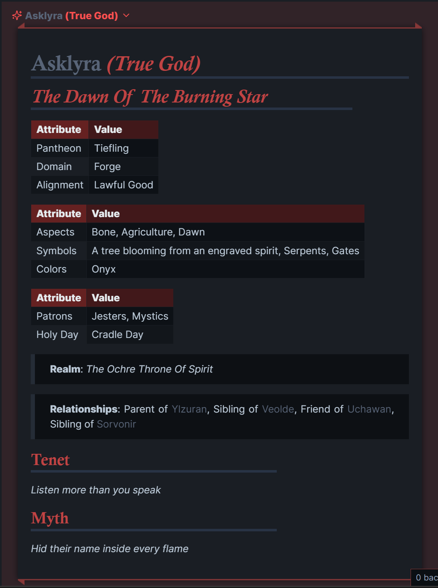

# Pantheon Generator for Obsidian

A randomized deity generator designed for worldbuilders, game masters, and TTRPG storytellers. This script dynamically assembles an original pantheon with rich detail using Templater inside [Obsidian](https://obsidian.md/).

---

## Overview

This generator creates deities across a structured divine hierarchy, assigning each one:

- **Name & Epithet**
- **Divine Tier** (True God, Demigod, Angel, etc.)
- **Domain, Alignment, and Pantheon**
- **Mythic Aspects** (tenets, holy days, myths, etc.)
- **Relationships** (parent of, lover of, rival to, etc.)
- **Symbols, Realms, Ruins, Missions, Martyrdom**

It also outputs:
- A visual **family tree** using Mermaid.js
- A collapsible **summary table** of all gods
- Individual deity `.md` files auto-saved by tier

---

## Divine Hierarchy

This project uses a custom cosmological framework inspired by comparative mythology. The ten tiers include:

1. **Prime Source** – The unknowable origin
2. **True Gods** – Realm-holding supreme deities
3. **Lesser Gods** – Regional or narrower in domain
4. **Demigods** – Mortal-divine hybrids
5. **Angels** – Created servants of higher gods
6. **Saints** – Mortals exalted through martyrdom
7. **Champions** – Mortal agents on divine missions
8. **False Gods** – Belief-born, unstable deities
9. **Shattered Gods** – Dead, fragmented, or forgotten deities
10. **Conceptualism** – Worship of abstract forces

See `Hierarchy.md` for full descriptions and examples.

---

## How It Works

### Tools Required:
- [Obsidian](https://obsidian.md/)
- [ITS Theme](https://github.com/SlRvb/Obsidian--ITS-Theme)
- [Templater Plugin](https://github.com/SilentVoid13/Templater)
- [Meta Bind Plugin](https://github.com/mProjectsCode/obsidian-meta-bind-plugin)

### Input Data:
Each `.md` file in `z_Generators/Pantheon Generator/data` contains word banks (e.g., `colors.md`, `myths.md`, `tenets.md`) used to construct gods.

### Config Settings:
The generator reads your preferences from `settings.md`, including:
- The **Pantheon** (`Human`, `Elf`, `Dwarf`, etc.) or choose `Random`
- Number of gods by tier (True Gods, Demigods, Angels, etc.)

### Core Script:
The `pantheon-generator.md` file:
- Loads data dynamically
- Generates a unique name and profile for each god
- Automatically creates `.md` notes under:  
  `2-World/Cosmology/Deities/{tier}/{god_name}.md`
 - The `Deities` folder can be safely deleted and will be auto-created after re-running the generator.
- Links and styles the output using callouts and Mermaid

---

## Output Example

- Mermaid.js family tree (auto-clustered by parents/siblings)
- Scrollable summary table of all gods and traits
- Unique icons and tier-color callouts
- Auto-generated relationships (e.g., "Sibling of [[Vorthak]]")

---

## License

This project is open source under the **MIT License**.  
Creative elements (e.g., myths, tenets, names) are shared under **CC BY-NC 4.0**.  
Feel free to fork, adapt, and expand—just don’t sell it without permission.

---

## Credits

Made by [@Gulgrot](https://github.com/Gulgrot) as a hobby project.  
Powered by storytelling, mythography, and procedural love.

---

## Related

- [`pantheon-generator.md`](./pantheon-generator.md) – Main logic file
- [`settings.md`](./settings.md) – User controls and pantheon config
- [`Hierarchy.md`](./Hierarchy.md) – Divine tier structure
- `/data/` – Word banks (aspects, tenets, names, etc.)
